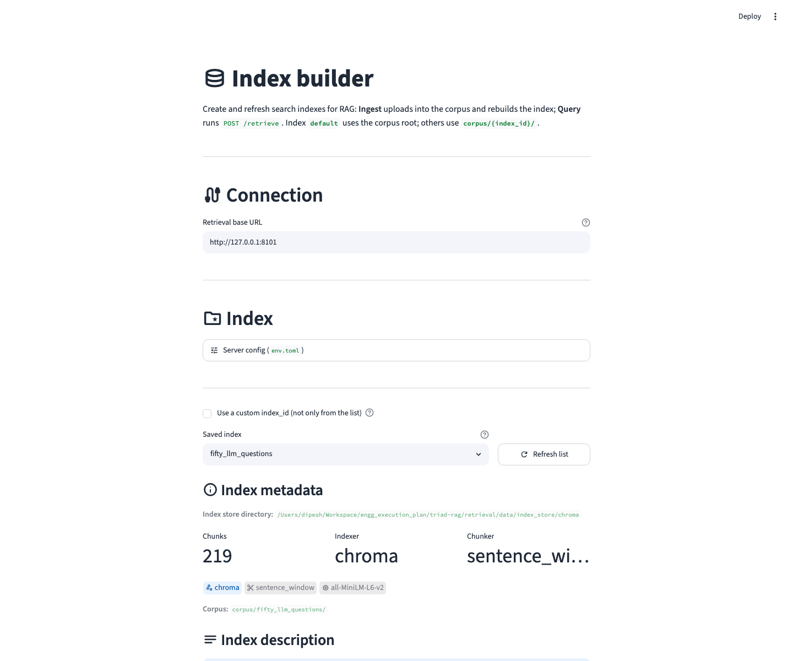
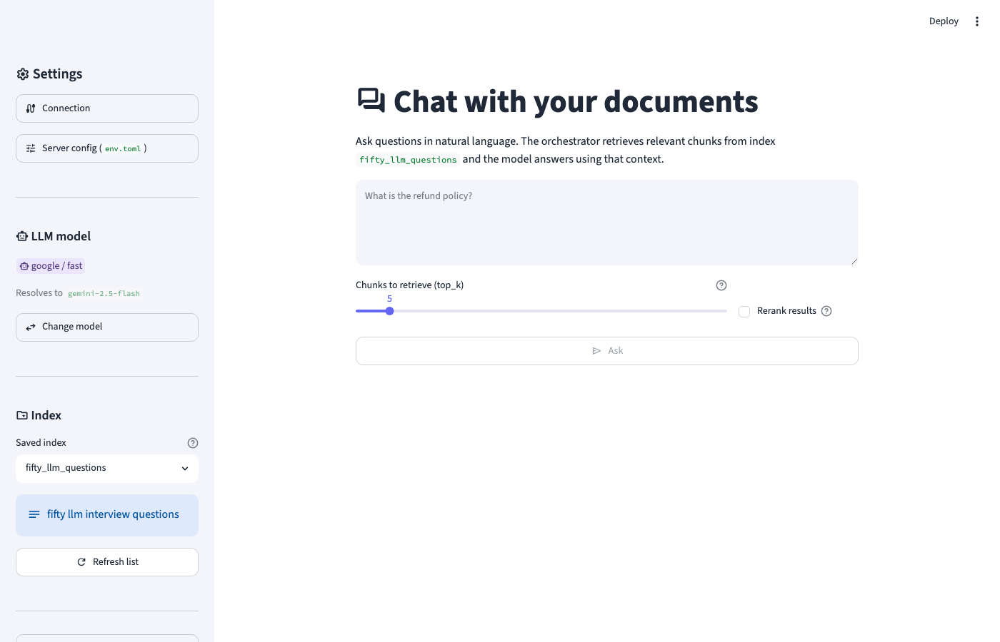

# triad-rag

## Problem we solve

You have documents (PDFs, notes) and want **answers grounded in those files** — not open-web guesses. That needs three steps: **ingest** files into searchable chunks, **retrieve** relevant passages for a question, and **generate** an answer from those passages only.

**Not in scope:** a single monolith, shared Python imports between services, or retrieval calling an LLM directly.

---

## How this project solves it

Three **HTTP services** (retrieval, orchestrator, generation) and three **UIs**. No shared Python code between services — they talk over HTTP only.


| | Talks to |
|---|----------|
| **Index UI** (`retrieval/ui/index.py`) | Retrieval `:8101` — upload, manage collections, test search |
| **Chat UI** (`ui/chat.py`) | Orchestrator `:8100` — questions and answers |
| **Eval UI** (`eval/ui/run.py`) | Orchestrator + retrieval + generation — golden-set metrics |
| **Orchestrator** `:8100` | Retrieval + generation (for chat and settings) |
| **Retrieval** `:8101` | Files, indexes, search |
| **Generation** `:8102` | LLM answers from passages |

**Upload:** Index UI → retrieval — save files, chunk, build indexes (`corpus/` + `index_store/`).

**Chat:** Chat UI → orchestrator → retrieval (passages) → generation (answer).

Search mode is chosen **once per collection** at upload (`chroma`, `bm25`, or `hybrid`). Optional rerank and expand are per search (or from `env.toml` defaults). Retrieval never calls the LLM; generation never searches files.

Architecture detail: [`docs/DESIGN.md`](docs/DESIGN.md).

| Read this if you want… | Where |
|------------------------|-------|
| Run it now | [Quick start](#quick-start) |
| Chunker / indexer choices | [What to know before upload](#what-to-know-before-upload) |
| Batch quality checks | [Evaluation](#evaluation) |
| Modules, routes, disk layout | [`docs/DESIGN.md`](docs/DESIGN.md) |

---

## Quick start

From project root (`triad-rag/`). Python 3.10+.

### 1. Setup (once)

```bash
cd triad-rag
python3 -m venv .venv313
source .venv313/bin/activate
pip install -r requirements.txt
cp env.toml.bak env.toml
```

Edit `env.toml`: set `api_key` under `[generation.google]` (or use `stub` for local testing without an API), and fill in `corpus_dir` / `index_store_dir` under `[retrieval]` if empty.

First upload may download the embedding model (`all-MiniLM-L6-v2`). Retrieval loads all models in `available_embedding_models` at startup.

### 2. Run the three services

Three terminals. Activate the venv in each. Run from the service folder.

```bash
source .venv313/bin/activate

# Terminal 1 — orchestrator :8100
cd orchestrator && python -m app.main

# Terminal 2 — retrieval :8101
cd retrieval && python -m app.main

# Terminal 3 — generation :8102
cd generation && python -m app.main
```

Optional: `--host 0.0.0.0`, `--no-reload`.

```bash
curl -s http://127.0.0.1:8100/health
curl -s http://127.0.0.1:8101/health
curl -s http://127.0.0.1:8102/health
```

### 3. Run the UIs

**Index** (upload + test search):

```bash
cd triad-rag
streamlit run retrieval/ui/index.py
```

**Chat** (questions + answers):

```bash
cd triad-rag
streamlit run ui/chat.py
```

**Eval** (golden-set metrics — see [Evaluation](#evaluation)):

```bash
cd triad-rag
streamlit run eval/ui/run.py
```

### UI screenshots

**Index UI** — upload files, view collection metadata, test search on the Query tab:

<p align="center">
  
</p>

**Chat UI** — select a collection and ask questions (orchestrator → retrieval → generation):

<p align="center">
  
</p>

### 4. First use

1. **Index UI** — upload a file, pick indexer/chunker on a new collection (custom `index_id` if none saved yet).
2. Same UI — **Query** tab to test search (passages only).
3. **Chat UI** — pick a saved collection, ask a question.

Or use [Commands](#commands) below.

---

## What to know before upload

In the **Index UI** you pick a **chunker** (how the file is split) and an **indexer** (how search works: `chroma`, `bm25`, or `hybrid`). You pick these **once per collection** — later uploads to the same `index_id` keep the same settings. To change them, create a new collection. Chunk size/overlap and related tuning are in `env.toml` only.

### Supported files

- **`.txt` and `.pdf` only.**
- PDFs are read as **plain text per page** — no headings, tables, or layout.
- Re-uploading a file replaces its chunks; it does not unlock chunker or indexer.

### Chunker and indexer

| Choice | What it does |
|--------|----------------|
| **simple** (default chunker) | Fixed-size splits. Default for most PDF/txt. |
| **markdown** chunker | Splits on `#` headings. **Markdown `.txt` only** — convert PDFs first. |
| **hierarchical** chunker | Small search hits; can return wider parent text with **chroma** or **hybrid** when expand is on. **Do not use with `bm25` alone.** |
| **sentence_window** chunker | FAQ-style: search anchor sentence, return window in results |
| **semantic** chunker | Splits by topic; needs the embedding model at ingest. |
| **chroma** indexer | Search by meaning (embeddings). |
| **bm25** indexer | Search by keywords. Set `sparse_backend` in `env.toml` (`json_bm25` or `sqlite_bm25`). |
| **hybrid** indexer | Meaning + keywords. Good default. |

**If you are unsure:** `simple` + `hybrid`.

Other combos: [`docs/chunking-strategies.md`](docs/chunking-strategies.md) · [`docs/retrieval-strategies.md`](docs/retrieval-strategies.md).

### Chat

- Set an LLM provider in `env.toml` (`google`, `openai`, `anthropic`, or **`stub`** for testing without an API).
- The answer comes **only from retrieved passages** — bad chunks or bad search means bad answers.

---

## Evaluation

Batch-check the pipeline against a **golden set**: fixed questions with reference answers and optional expected source locations. Eval uses the same HTTP APIs as chat and writes a versioned CSV under `eval/datasets/<dataset_id>/reports/`.

For each question: search → check if expected file/page appears → run chat → optionally judge **faithfulness** (is the answer supported by retrieved text?). Faithfulness needs a real LLM; use **Skip faithfulness** in the UI or `--skip-faithfulness` on the CLI with `stub`.

**Dataset:** `eval/datasets/<dataset_id>/golden.jsonl` — one JSON object per line:

```json
{
  "question": "What is the refund policy?",
  "ground_truth": "Full refund within 30 days of purchase.",
  "expected_source": "handbook.pdf",
  "expected_page": 12
}
```

`question` and `ground_truth` are required. `expected_source` must match an uploaded filename; `expected_page` is PDF-only (omit for `.txt`). Ingest all referenced files into the collection before running (default collection name = dataset folder name).

```bash
# UI (services must be running)
streamlit run eval/ui/run.py

# CLI
python eval/run_eval.py --dataset my_dataset
python eval/run_eval.py --dataset my_dataset --skip-faithfulness
python eval/run_eval.py --dataset my_dataset --index-id my_collection --top-k 5
```

Example dataset in repo: `eval/datasets/top_llm_questions/`. Optional env: `RETRIEVAL_API_URL`, `ORCHESTRATOR_API_URL`, `GENERATION_API_URL`.

---

## Commands

| Task | Command |
|------|---------|
| List collections | `curl -s http://127.0.0.1:8101/indices` |
| Ingest options | `curl -s http://127.0.0.1:8101/ingest/options` |
| Upload file | `curl -s -X POST http://127.0.0.1:8101/ingest -F file=@doc.pdf -F index_id=default -F indexer=hybrid -F embedding_model=all-MiniLM-L6-v2 -F chunker_name=simple` |
| Search (passages) | `curl -s -X POST http://127.0.0.1:8101/retrieve -H 'Content-Type: application/json' -d '{"query":"What is RAG?","top_k":3,"index_id":"default","rerank":false,"expand":true}'` |
| Chat (answer + sources) | `curl -s -X POST http://127.0.0.1:8100/query -H 'Content-Type: application/json' -d '{"question":"What is RAG?","index_id":"default","top_k":3,"rerank":false}'` |
| List models | `curl -s http://127.0.0.1:8102/models` |
| Run eval (UI) | `streamlit run eval/ui/run.py` (from repo root; services up) |
| Run eval (CLI) | `python eval/run_eval.py --dataset my_dataset` |

API docs: `http://127.0.0.1:8100/docs`, `:8101/docs`, `:8102/docs`.

---

## Configuration

`env.toml.bak` → `env.toml` (gitignored).

| Section | Main settings |
|---------|----------------|
| `[orchestrator]` | `retrieval_url`, `generation_url`, timeouts, retries |
| `[retrieval]` | paths, chunkers, embedding models, `sparse_backend`, `search_expand`, rerank |
| `[generation]` | `default_provider`, `temperature` |
| `[generation.google]` | `api_key`, model aliases |

`generation/prompts.toml` — system prompt for the LLM.

Env overrides: `ORCH_*`, `RET_*`, `GEN_*`.

`sparse_backend = "none"` → only `chroma` at upload. Use `json_bm25` or `sqlite_bm25` for `bm25` and `hybrid`.

Runtime data under `retrieval/data/` and `examples/data/` is gitignored. Example scripts in `examples/` are tracked.

---

## Documentation

### Guides

| Doc | Contents |
|-----|----------|
| [`docs/DESIGN.md`](docs/DESIGN.md) | All three services — orchestrator, retrieval, generation |
| [`docs/chunking-strategies.md`](docs/chunking-strategies.md) | How each chunker splits documents |
| [`docs/retrieval-strategies.md`](docs/retrieval-strategies.md) | Chroma, BM25, hybrid, rerank, expand |

### Workflow diagrams

| | File |
|---|------|
| System (above) | [`system-overview.png`](docs/diagrams/system-overview.png) |
| Orchestrator | [`orchestrator_main.png`](docs/diagrams/orchestrator_main.png) |
| Retrieval | [`retrieval_main_workflow.png`](docs/diagrams/retrieval_main_workflow.png) |
| Generation | [`generation_main_workflow.png`](docs/diagrams/generation_main_workflow.png) |
| Metadata | [`retrieval_metadata_structure.png`](docs/diagrams/retrieval_metadata_structure.png) |
| Technical layout | [`technical_architecture.png`](docs/diagrams/technical_architecture.png) |
| Index UI | [`ui-index-screenshot.png`](docs/diagrams/ui-index-screenshot.png) |
| Chat UI | [`ui-chat-screenshot.png`](docs/diagrams/ui-chat-screenshot.png) |

Regenerate architecture diagrams: [`docs/diagrams/markdowns/`](docs/diagrams/markdowns/).

---

## License

This project is licensed under the [MIT License](LICENSE).

---

## Citation

If you use this project in research, teaching, or a write-up, please cite:

```bibtex
@software{gautam2026triadrag,
  author  = {Gautam, Dipesh},
  title   = {{triad-rag}: Document-grounded {RAG} with {HTTP} microservices},
  year    = {2026},
  url     = {https://github.com/dipeshgautam2012/triad-rag}
}
```

Plain text:

> Gautam, D. (2026). *triad-rag: Document-grounded RAG with HTTP microservices*. https://github.com/dipeshgautam2012/triad-rag
