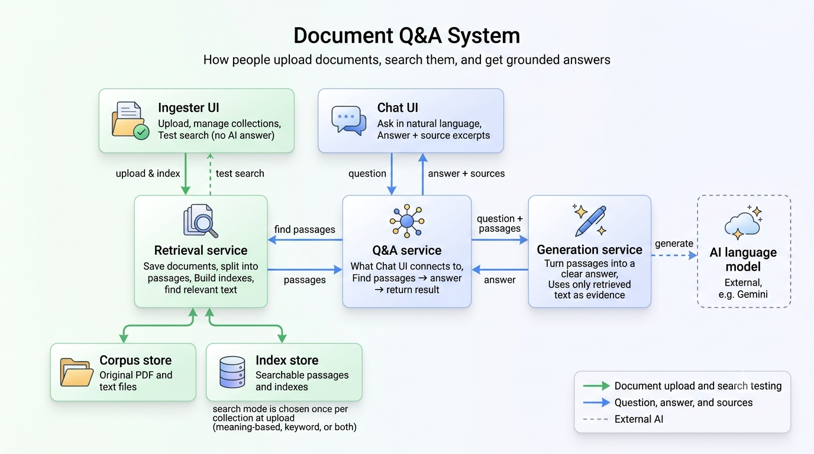
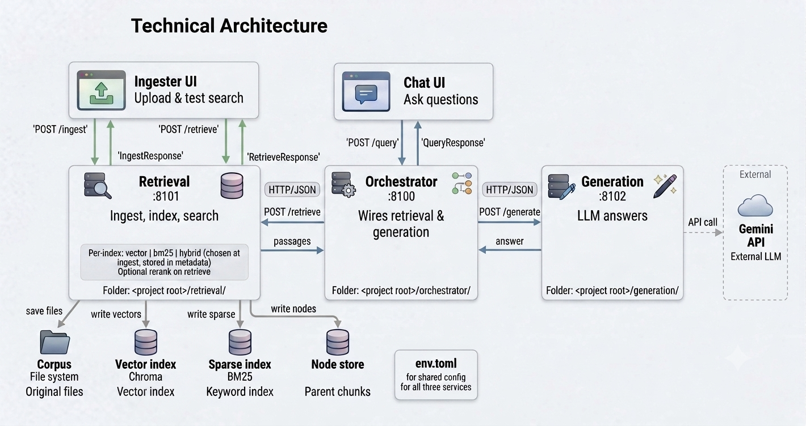
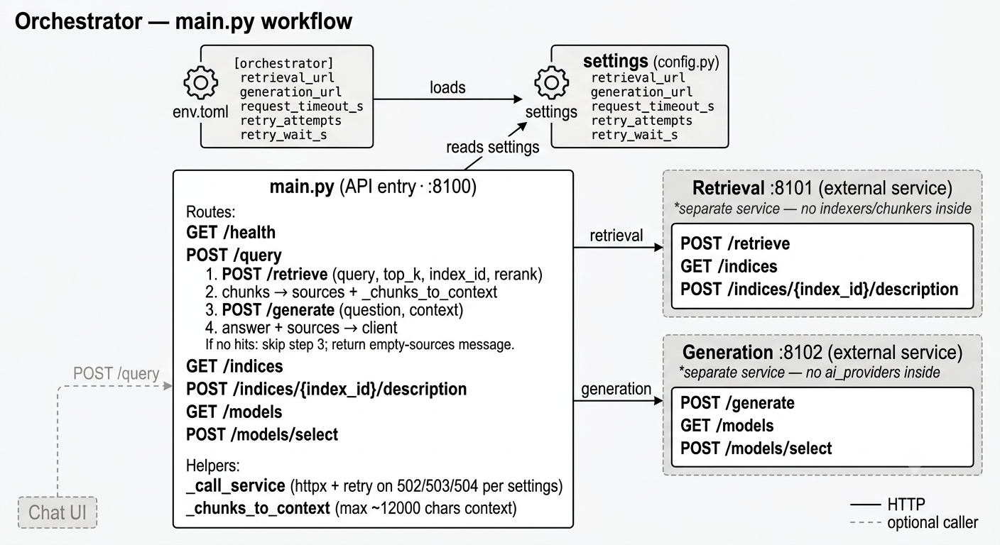
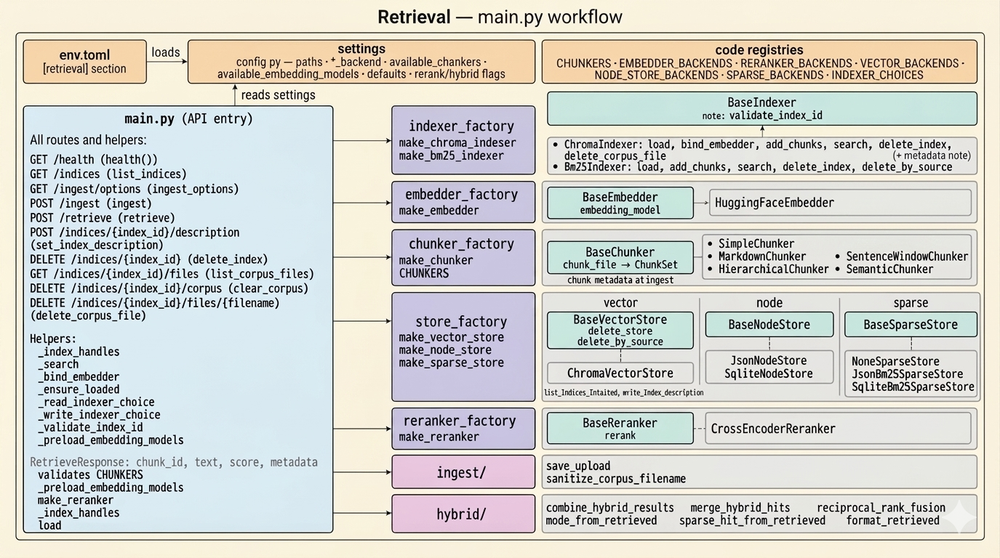
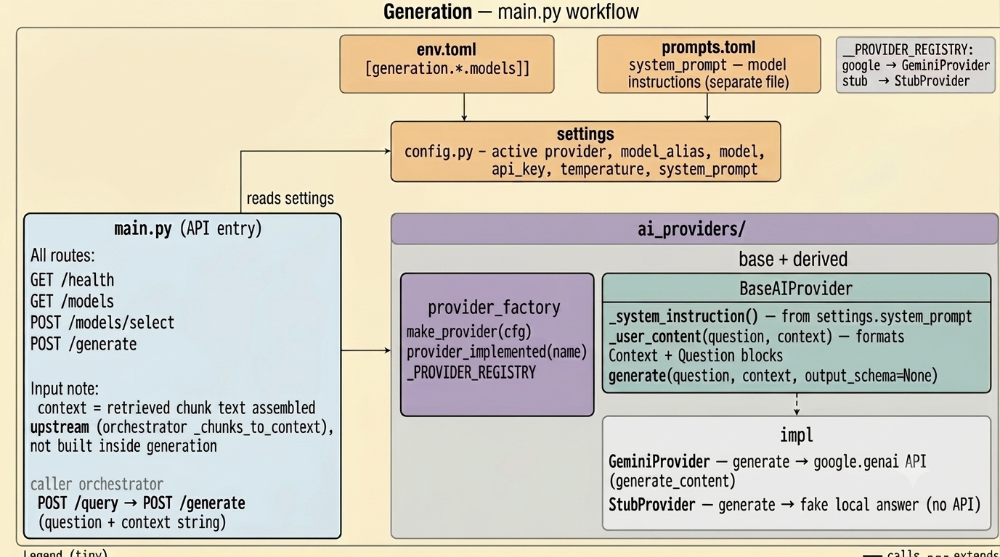
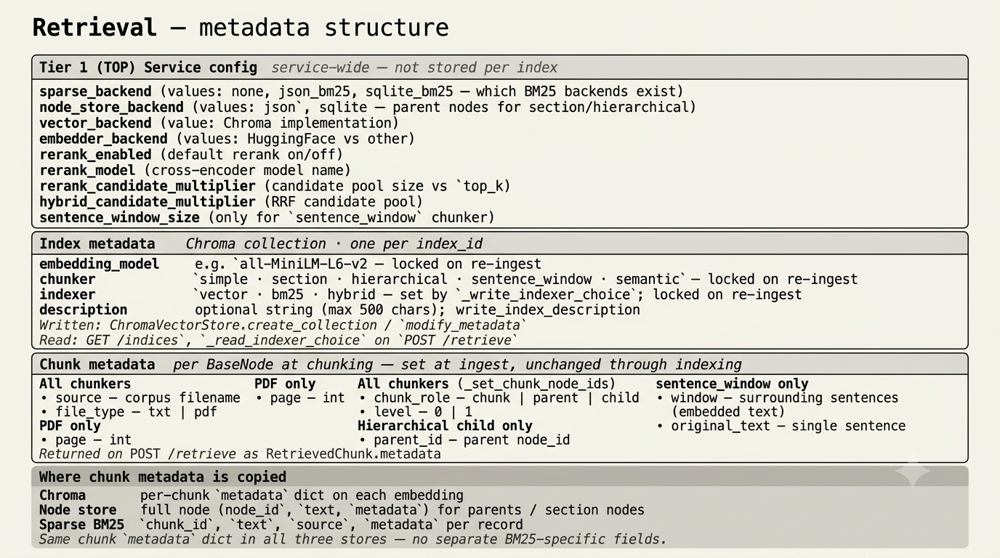

# triad-rag — design

Design for all three services: orchestrator, retrieval, and generation. Each section below has a diagram and a short description of what happens.

Config: `env.toml` at repo root. LLM system prompt: `generation/prompts.toml`.

---

## Rules

- Three services — separate processes, **HTTP + JSON only** (no cross-imports).
- **Settings** read in each service’s `main.py` and `config.py` only. Other code gets plain values and instances.
- **Factories** (`make_chunker`, `make_provider`, …) called from each service’s composition root (`main.py` / `orchestration.py`), not from deep packages.
- **Index UI** → retrieval only. **Chat UI** → orchestrator only. **Eval UI** → retrieval + orchestrator.

---

## System overview

Three Streamlit UIs, three backend services:

| What | Role | Calls |
|------|------|-------|
| **Index UI** (`retrieval/ui/index.py`) | Upload files, manage collections, test search (passages only) | **Retrieval** `:8101` |
| **Chat UI** (`ui/chat.py`) | Ask questions; get answers + sources | **Orchestrator** `:8100` |
| **Eval UI** (`eval/ui/run.py`) | Golden-set batch metrics | **Retrieval** `:8101` + **Orchestrator** `:8100` |
| **Retrieval** | Store files, build indexes, find passages | — |
| **Orchestrator** | Chains retrieval + generation for Q&A | Retrieval `:8101`, Generation `:8102` |
| **Generation** | Writes an answer from question + passages | External LLM API |

**Upload:** Index UI → retrieval → files saved and indexed.

**Chat:** Chat UI → orchestrator → retrieval (passages) → generation (answer) → Chat UI.

**Eval:** Eval UI → retrieval `/retrieve` + orchestrator `/query` per golden row → CSV report.



---

## Three UIs

Different apps, run separately, for different jobs.

### Index UI — upload and test search

**File:** `retrieval/ui/index.py` · **Run:** `streamlit run retrieval/ui/index.py` (from `triad-rag/`) · **Talks to:** `http://localhost:8101`

| Tab / area | What you do | Retrieval endpoint |
|------------|-------------|-------------------|
| **Ingest** | Upload PDF/txt; pick indexer/chunker/model (**new index only**) | `POST /ingest` |
| **Manage** | List collections, delete files/index, edit description | `GET /indices`, `DELETE …`, `POST /indices/{id}/description` |
| **Query** | Test search — passages and scores, no LLM | `POST /retrieve` |

`GET /indices` lists **saved** indexes only — an empty store shows no dropdown entry (use custom `index_id` for first ingest). **Server config** (`env.toml`) is shown read-only via `GET /ingest/options`.

Use it to upload files, manage collections, and run search **without** an LLM answer — so you can see passages, scores, optional **expand**, and (with rerank on) the wider hit list.

```
Index UI  ──────────────────────────────►  Retrieval :8101
            (upload · manage · search)
```

### Chat UI — ask questions, get answers

**File:** `ui/chat.py` · **Run:** `streamlit run ui/chat.py` (from `triad-rag/`) · **Talks to:** `http://localhost:8100`

| What you do | You call (orchestrator) | Orchestrator then calls |
|-------------|-------------------------|-------------------------|
| Ask a question | `POST /query` | retrieval `POST /retrieve`, then generation `POST /generate` |
| Pick collection or model | `GET /indices`, `GET /models`, `POST /models/select` | retrieval or generation |

The Chat UI never calls retrieval or generation directly. Orchestrator does that for you. **Expand** for chat uses retrieval’s `search_expand` default from `env.toml` (orchestrator does not forward `expand` yet).

```
Chat UI  ──POST /query──►  Orchestrator :8100
                                ├──► Retrieval :8101   (passages)
                                └──► Generation :8102  (answer)
                           ◄── answer + sources ──
```

### Eval UI — golden-set metrics

**File:** `eval/ui/run.py` · **Run:** `streamlit run eval/ui/run.py` (from `triad-rag/`) · **Talks to:** retrieval + orchestrator

Runs `eval/datasets/<id>/golden.jsonl` through `/retrieve` and `/query`, writes versioned CSV under `reports/`. Uses `rerank_enabled` and `search_expand` from `env.toml` (no per-run toggles in the UI).

| | Index UI | Chat UI | Eval UI |
|---|----------|---------|---------|
| **Job** | Upload files; test search | Ask questions; get answers | Batch quality metrics |
| **Talks to** | Retrieval `:8101` | Orchestrator `:8100` | Retrieval + orchestrator |
| **Search result** | Passage list (+ optional `candidates`) | Answer + source passages | Metrics CSV |
| **Expand / rerank** | Checkboxes on Query tab | Rerank checkbox; expand from config | Config defaults only |
| **Uses LLM?** | No | Yes | Yes (via orchestrator `/query`) |

---

## Technical architecture

Services are independent processes. Each has `main.py` as the HTTP entry point and small packages for pluggable parts (chunkers, providers, etc.). Factories in each service create the right implementation from config.



### Repo layout

```
triad-rag/
├── env.toml                 # shared config ([retrieval], [generation], [orchestrator])
├── ui/
│   └── chat.py              # Chat UI → orchestrator
├── eval/
│   └── ui/
│       └── run.py           # Eval UI
├── orchestrator/
│   └── app/
│       ├── config.py
│       └── main.py          # POST /query; calls retrieval + generation
├── retrieval/
│   ├── ui/
│   │   └── index.py         # Index UI → retrieval
│   ├── data/
│   │   ├── corpus/          # uploaded .txt / .pdf files
│   │   └── index_store/     # Chroma, BM25, node stores
│   └── app/
│       ├── config.py
│       ├── main.py          # HTTP routes only
│       ├── orchestration.py # ingest, search, index handles
│       ├── chunkers/
│       ├── embedders/
│       ├── indexers/
│       ├── stores/
│       ├── rerankers/
│       ├── hybrid/
│       └── ingest/
└── generation/
    ├── prompts.toml         # system prompt for the model
    └── app/
        ├── config.py
        ├── main.py          # generate + model selection APIs
        └── ai_providers/
```

---

## APIs

### Orchestrator (`:8100`) — Chat UI only

| Method | Path | What it does |
|--------|------|----------------|
| GET | `/health` | Health check |
| POST | `/query` | Search retrieval, then ask generation; return answer + sources |
| GET | `/indices` | List collections (orchestrator calls retrieval) |
| GET | `/models` | List models (orchestrator calls generation) |
| POST | `/models/select` | Change model (orchestrator calls generation) |
| POST | `/indices/{id}/description` | Set description (orchestrator calls retrieval) |

### Retrieval (`:8101`) — Index UI (and orchestrator for chat)

| Method | Path | Purpose |
|--------|------|---------|
| GET | `/health` | Health check |
| GET | `/indices` | List saved collections and their settings |
| GET | `/ingest/options` | Allowed chunkers/models/indexers + read-only `env.toml` defaults |
| POST | `/ingest` | Upload a file and index it |
| POST | `/retrieve` | Search: return top passages for a question |
| POST | `/indices/{id}/description` | Update collection description |
| DELETE | `/indices/{id}` | Delete a collection |
| GET | `/indices/{id}/files` | List files in a collection |
| DELETE | `/indices/{id}/corpus` | Clear all files in a collection |
| DELETE | `/indices/{id}/files/{name}` | Delete one file |

**`POST /retrieve`:** send `query`, `top_k`, `index_id`, optional `rerank`, optional `expand`. Omitted `rerank` / `expand` fall back to `rerank_enabled` / `search_expand` in `env.toml`. Returns `chunks` (final hits) and optional `candidates` (pre-rerank / pre-trim pool). Index UI uses this directly; orchestrator uses it during chat and only keeps `chunks`.

**`POST /ingest`:** multipart upload. On a **new** index you may set `indexer`, `chunker_name`, `embedding_model`, `index_description`. Re-ingest to an existing index must match stored chunker/embedding/indexer (409 otherwise). Chunk size/overlap and per-chunker tuning come from `env.toml` only.

### Generation (`:8102`) — answer from context

| Method | Path | Purpose |
|--------|------|---------|
| GET | `/health` | Health check |
| GET | `/models` | List providers and model aliases |
| POST | `/models/select` | Switch provider / model |
| POST | `/generate` | Answer a question using provided context |

**`POST /generate` body:** `question`, `context` (passages as plain text). Generation does not call retrieval itself.

---

## Orchestrator workflow

Chat UI talks here (`:8100`). `main.py` reads `env.toml` `[orchestrator]` and calls retrieval and generation over HTTP.

**`POST /query`:** `POST /retrieve` on retrieval → turn passages into numbered text → `POST /generate` on generation → return `answer` + `sources`.

**Other routes:** indices and descriptions go to retrieval; models go to generation. Chat UI only needs `:8100`.



### Files

```
orchestrator/app/
├── main.py       # routes, HTTP client, builds context from passages
└── config.py     # retrieval_url, generation_url, timeout, retries
```

| Service | Port | Called for |
|---------|------|------------|
| Retrieval | `:8101` | `/retrieve`, `/indices`, `/indices/{id}/description` |
| Generation | `:8102` | `/generate`, `/models`, `/models/select` |

---

## Retrieval workflow

Index UI talks here directly. Orchestrator calls here when you chat.

`main.py` exposes HTTP routes. `orchestration.py` wires chunkers, indexers, stores, ingest, and search — the composition root for retrieval behavior.

**Ingest:** save file → chunk (settings from `env.toml`) → embed (if chroma/hybrid) → write to stores → record index metadata.

**Retrieve:** `search_index()` by stored mode (`chroma`, `bm25`, or `hybrid`) → optional expand → optional rerank → return passages.



### Packages

```
retrieval/app/
├── main.py              # HTTP routes
├── orchestration.py     # ingest_file, search_index, index handles
├── config.py            # settings from env.toml [retrieval]
├── chunkers/            # split files into passages
├── embedders/           # text → vectors (HuggingFace)
├── indexers/            # ChromaIndexer, Bm25Indexer (search + expand)
├── stores/              # Chroma vector, node store, BM25 sparse
├── rerankers/           # optional second-pass scoring
├── hybrid/              # RRF merge (single __init__.py)
└── ingest/              # corpus paths + file upload helpers
```

### Three storage roles

| Store | Holds | Search use | On disk |
|-------|-------|------------|---------|
| **Vector** | Embeddings + vectors | Meaning similarity | `index_store/chroma/` |
| **Node** | Non-embedded nodes (e.g. parents) | Auto-merge to wider passages | `index_store/node_store/{id}.json` or `.sqlite` |
| **Sparse** | Chunk text for BM25 | Keyword search | `index_store/sparse/<id>/` |

### Search mode vs rerank vs expand

**Indexer** (picked once at first upload, stored on the collection as `indexer`; API values `chroma`, `bm25`, `hybrid` — legacy metadata may say `vector` for chroma):

| Mode | Meaning |
|------|---------|
| `chroma` | Similar meaning to the question (Chroma embeddings) |
| `bm25` | Matching keywords |
| `hybrid` | Both, then combined (RRF) |
| **expand** (optional per request) | Wider passage text (hierarchical parent, sentence window, etc.) via `search(..., expand=)` |
| **rerank** (optional per request) | Re-order a wider hit list with a cross-encoder |

**Order inside `search_index()`:**

```
bm25:     BM25 search → optional expand → optional rerank
hybrid:   chroma search → BM25 search → RRF fusion → optional expand → optional rerank
chroma:   chroma search → optional expand → optional rerank
```

Fusion merges two hit lists (no model). Expand widens hit text from the node store / window metadata. Rerank re-scores one candidate list. They are separate optional stages.

### What each UI controls

| UI | Talks to | At upload | At search / eval |
|----|----------|-----------|------------------|
| **Index UI** | Retrieval `:8101` | Indexer, chunker, embedding (**new index only**); description | `top_k`, expand, rerank checkboxes |
| **Chat UI** | Orchestrator `:8100` | Saved index, LLM model | `top_k`, rerank checkbox |
| **Eval UI** | Retrieval + orchestrator | Dataset, index, model | `top_k`; rerank/expand from `env.toml` |

Chunk size, overlap, and per-chunker tuning are **`env.toml` only** (shown read-only in UIs via `/ingest/options`). Search mode is not chosen per question; it is stored on the collection when you first upload.

### Example API flows

Who calls what, what JSON comes back, what the UI shows. Examples are shortened.

#### Call map

| You do this | UI | HTTP call | Who returns the JSON |
|-------------|-----|-----------|----------------------|
| Upload a file | Index UI | `POST http://localhost:8101/ingest` | **Retrieval** |
| Test search | Index UI | `POST http://localhost:8101/retrieve` | **Retrieval** |
| Ask a question | Chat UI | `POST http://localhost:8100/query` | **Orchestrator** (after retrieval + generation) |
| List collections (index UI) | Index UI | `GET http://localhost:8101/indices` | **Retrieval** |
| List collections (chat) | Chat UI | `GET http://localhost:8100/indices` | **Orchestrator** (asks retrieval) |

#### 1. Upload a file

```
Index UI  ──POST /ingest──►  Retrieval :8101  ──►  IngestResponse
```

**Retrieval returns:**

```json
{
  "index_id": "default",
  "saved_as": "policy.pdf",
  "chunks_indexed": 42,
  "embedding_model": "all-MiniLM-L6-v2",
  "chunker": "simple",
  "indexer": "hybrid",
  "ready": true
}
```

| `indexer` at upload | What retrieval built | `embedding_model` |
|---------------------|----------------------|-------------------|
| `chroma` | Chroma embeddings only | model name |
| `bm25` | BM25 keyword index only | `null` |
| `hybrid` | Both chroma and BM25 | model name |

#### 2. Test search (Index UI)

```
Index UI  ──POST /retrieve──►  Retrieval :8101  ──►  RetrieveResponse
```

You do **not** send indexer — retrieval reads `indexer` from collection metadata. You may send `rerank` and `expand` (or omit for `env.toml` defaults).

```json
{
  "query": "What is the refund policy?",
  "index_id": "default",
  "chunks": [
    {
      "chunk_id": "policy.pdf#p2chunk1",
      "text": "Refunds are available within 30 days…",
      "score": 0.82,
      "metadata": { "source": "policy.pdf", "file_type": "pdf", "page": 2 }
    }
  ],
  "candidate_count": 0,
  "candidates": []
}
```

With **rerank on**, `chunks` is the reranked top-k and `candidates` holds the wider pre-rerank pool (Index UI shows both).

#### 3. Ask a question (Chat UI)

```
Chat UI  ──POST /query──►  Orchestrator :8100
                              ├── POST /retrieve  → Retrieval
                              └── POST /generate  → Generation
                           ◄── answer + sources
```

**Inside orchestrator:**

1. Call retrieval `POST /retrieve`
2. Take `chunks` (ignore `candidates`)
3. Build numbered passage text for the model (~12k char cap)
4. Call generation `POST /generate`
5. Return `answer` + `sources` to Chat UI

**Orchestrator returns** (only JSON the Chat UI sees):

```json
{
  "answer": "Refunds are available within 30 days of purchase…",
  "sources": [
    {
      "chunk_id": "policy.pdf#p2chunk1",
      "text": "Refunds are available within 30 days…",
      "score": 0.82,
      "metadata": { "source": "policy.pdf", "file_type": "pdf", "page": 2 }
    }
  ]
}
```

`sources` are the same passages as retrieval’s `chunks`. No `candidates` in this response.

---

## Generation workflow

Used when you chat — orchestrator calls `POST /generate` after search. Index UI does not use this service.

`main.py` loads settings, picks an LLM provider, calls `generate(question, context)`.



### Packages

```
generation/app/
├── main.py              # HTTP routes
├── config.py            # settings from env.toml + prompts.toml
└── ai_providers/
    ├── provider_factory.py
    ├── gemini_provider.py   # Google Gemini API
    └── stub_provider.py     # local fake answers (dev/test)
```

Config sources:
- `env.toml` `[generation]` — provider, model, temperature, API keys
- `prompts.toml` — `system_prompt` (loaded into `settings.system_prompt` at startup)

---

## Metadata structure

Three levels of metadata in retrieval:

1. **Service config** (`env.toml`) — global defaults: backends, `search_expand`, `rerank_enabled`, chunk size/overlap, allowed chunkers/models. Exposed read-only on `GET /ingest/options`. Not stored per collection.

2. **Index metadata** (one record per collection in Chroma) — `embedding_model`, `chunker`, `indexer`, `description`. Set on first ingest; indexer/chunker/embedding are locked on re-ingest.

3. **Chunk metadata** (per passage) — `source`, `file_type`, optional `page` (PDF), `chunk_role` / `parent_id` (hierarchical), `window` / `original_text` (sentence window). Same dict is copied to vector store, node store, and BM25 store. Returned on `POST /retrieve` as `RetrievedChunk.metadata`.



---

## Related docs

| Doc | Contents |
|-----|----------|
| [`../README.md`](../README.md) | Getting started, commands |
| [`chunking-strategies.md`](chunking-strategies.md) | How each chunker splits documents |
| [`retrieval-strategies.md`](retrieval-strategies.md) | Chroma, BM25, hybrid, rerank, expand |
| [`diagrams/markdowns/`](diagrams/markdowns/) | Workflow notes for regenerating images — **may lag code**; trust this file and source over those markdowns |
