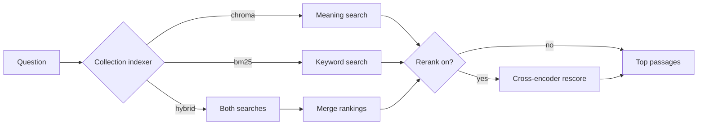

# Retrieval strategies

Retrieval finds the passages most relevant to a question. Two decisions matter:

1. **Indexer** (chosen at **first upload**, stored per collection): `chroma`, `bm25`, or `hybrid`
2. **Rerank** (chosen at **query time** in the UI): re-score a wider candidate list for better ordering

Search mode is **not** switched per query — the collection remembers its indexer.

**Hybrid collections** run two searches, fuse them with **RRF**, then optionally **rerank** — see [Hybrid at a glance](#hybrid-at-a-glance-rrf-and-rerank) below.

---

## Overview



---

## Hybrid at a glance (RRF and rerank)

Hybrid runs **two searches on the same question**, merges their ranked lists, then optionally reranks. RRF and rerank are **separate steps** — RRF combines vector + keyword lists; rerank re-scores whatever list RRF produced.

### Query pipeline

```
question
  │
  ├─► Vector search (meaning)     ──► ranked list A   (parent merge may run here)
  │
  └─► BM25 search (keywords)      ──► ranked list B   (no parent merge)
              │
              ▼
         RRF merge  ──► one fused ranked list
              │
              ├─ rerank off ──► top_k from fused list
              │
              └─ rerank on  ──► cross-encoder rescores fused list ──► top_k
```

**Step 1 — Build a candidate pool.** Retrieval fetches more than `top_k` hits from each engine. Pool size is `top_k × hybrid_candidate_multiplier` (default 4). If rerank is on, the pool may be widened further to `top_k × rerank_candidate_multiplier`, whichever is larger.

**Step 2 — Vector search.** Chroma returns the top passages by embedding similarity. On the **hierarchical** chunker, the vector leg may expand child hits to a parent when **`ratio > 0.4`** (see [`chunking-strategies.md`](chunking-strategies.md#parent-merge-auto-merge)). BM25 does not do this.

**Step 3 — BM25 search.** Sparse index returns the top passages by keyword match — same `top_k` pool size, independent ranking.

**Step 4 — RRF merge.** The two lists are combined by **Reciprocal Rank Fusion**:
- RRF does **not** add vector scores to BM25 scores (they are on different scales).
- For each chunk, it adds points based on **rank position** in each list: higher rank → more points.
- A chunk that ranks well in **either** or **both** lists rises in the fused ordering.
- Chunks that appear in both lists get points from both — that is why hybrid helps when meaning search and keyword search disagree.

```
Vector list:   1st chunk_A, 2nd chunk_C, 3rd chunk_B
Keyword list:  1st chunk_B, 2nd chunk_A, 3rd chunk_D
                    ↓ RRF (rank positions only)
Fused list:    chunk_A, chunk_B, chunk_C, chunk_D, …
```

**Step 5 — Rerank (optional).** If the rerank checkbox is on, a cross-encoder reads the **fused** list (not the raw chroma or BM25 lists separately) and re-scores each `(question, passage)` pair. The best `top_k` after reranking become final `chunks`. The fused list **before** rerank is returned as `candidates` in the API (Index UI shows this in **Candidate pool**).

If rerank is off, the top `top_k` from the fused list are returned directly. The full fused pool may still appear as `candidates`.

### RRF vs rerank (one line each)

| Step | Question it answers | When (hybrid) |
|------|---------------------|---------------|
| **RRF** | How do I merge vector and keyword hit lists into one? | Always, after both searches |
| **Rerank** | How do I improve ordering within that merged list? | Only if rerank is on at query time |

Rerank never runs instead of RRF on hybrid — order is always: **vector + BM25 → RRF → rerank (optional) → top_k**.

---

## Quick comparison

| Strategy | What it matches | Index built at ingest | Main library |
|----------|-----------------|----------------------|--------------|
| **chroma** | Similar *meaning* | Embeddings in Chroma | `chromadb`, `llama_index` |
| **bm25** | Important *words* | BM25 sparse index | `bm25s` |
| **hybrid** | Both | Vector + BM25 | Chroma + `bm25s` + custom RRF |
| **rerank** (add-on) | Query + passage together | Pre-loaded cross-encoder model | `sentence-transformers` via LlamaIndex |

**Embedding model** (chroma / hybrid): `sentence-transformers` through `llama_index.embeddings.huggingface` (default: `all-MiniLM-L6-v2`).

---

## chroma (meaning-based)

**How it works**

1. At ingest, each chunk is turned into a numeric vector (embedding).
2. At query, the question is embedded the same way.
3. Chunks with vectors closest to the question vector are returned.

**Simple picture**

```
Question: "How do I get a refund?"
          ↓ embed
Chunk A:  "Refunds within 30 days…"     ← high similarity ✓
Chunk B:  "Shipping takes 5–7 days…"    ← low similarity
```

**Good when:** users ask in natural language and exact keywords may not appear in the document.

**Storage:** Chroma collection under `data/index_store/chroma/`.

**Code path:** `ChromaIndexer.search` → LlamaIndex `VectorIndexRetriever`.

---

## bm25 (keyword-based)

**How it works**

1. At ingest, chunks are tokenized and indexed by term frequency (classic keyword search).
2. At query, words in the question are matched against chunk text.
3. Higher scores = more keyword overlap (with BM25 weighting).

**Simple picture**

```
Question: "refund policy"
Chunk A:  "The refund policy allows…"   ← strong word match ✓
Chunk B:  "Returns and exchanges…"      ← weaker match
```

**Good when:** exact terms, codes, or names matter; or you want search without embedding cost at query time.

**Note:** A Chroma collection still exists for collection metadata, but there may be **zero** vector chunks.

**Storage:** `data/index_store/sparse/<index_id>/` via `bm25s`.

**Code path:** `Bm25Indexer.search`.

---

## hybrid (both, then merge)

High-level pipeline: [Hybrid at a glance](#hybrid-at-a-glance-rrf-and-rerank).

**How it works**

1. At ingest, **both** vector and BM25 indexes are built (same `embed_chunks`).
2. At query, each engine returns its own ranked list (same pool size).
3. **RRF** merges the two lists by rank position.
4. Optionally **rerank** re-scores the fused list, then return `top_k`.

**Simple picture**

```
Vector top hits:     [chunk_A, chunk_C, chunk_B]
Keyword top hits:    [chunk_B, chunk_A, chunk_D]
                              ↓ RRF merge
Final fused list:    [chunk_A, chunk_B, chunk_C, chunk_D]
```

RRF does not add scores from different scales; it rewards chunks that appear near the top in either list.

**Good when:** you want both paraphrase matching (vector) and exact-term matching (keyword).

**Code path:** `orchestration.search_index` → `chroma.search` + `bm25.search` → `combine_hybrid_results` → optional `reranker.rerank`.

**Config:** `hybrid_candidate_multiplier` (pool size before RRF trim); `rerank_candidate_multiplier` (may widen pool when rerank is on).

---

## rerank (optional second pass)

Rerank is **not** a third indexer. It is a checkbox at query time (Index UI and Chat UI), or a default in `env.toml` (`rerank_enabled`).

On **hybrid**, rerank runs **after RRF** on the fused list — see [Hybrid at a glance](#hybrid-at-a-glance-rrf-and-rerank).

**How it works**

1. Retrieval fetches a **wider pool** (e.g. `top_k × 4` candidates).
2. A **cross-encoder** model scores each `(question, passage)` pair together.
3. Only the best `top_k` after reranking are returned.

**Simple picture**

```
Initial retrieval (fast):   [A, B, C, D, E, F, …]  ← 12 candidates
Cross-encoder (slower):     B and A are truly best for this question
Final results:              [B, A, C]
```

**Good when:** quality matters more than speed, or first-pass ordering is noisy.

**Index UI:** shows the pre-rerank pool in a **Candidate pool** expander (`candidates` in the API).

**Code path:** `CrossEncoderReranker` → LlamaIndex `SentenceTransformerRerank`.

**Config:** `rerank_enabled` (default if UI leaves rerank unset), `rerank_model`, `rerank_candidate_multiplier`.

---

## How strategies combine

| Collection indexer | Rerank off | Rerank on |
|--------------------|------------|-----------|
| **chroma** | Top `top_k` by embedding similarity; optional **expand** | Wider chroma pool → optional expand → cross-encoder → top `top_k` |
| **bm25** | Top `top_k` by keyword score; optional **expand** | Wider BM25 pool → optional expand → cross-encoder → top `top_k` |
| **hybrid** | RRF merge → top `top_k`; API returns fused pool as `candidates` | Wider pool → chroma + BM25 → RRF → optional expand → cross-encoder on fused list → top `top_k`; `candidates` = pre-rerank fused pool |

**Hierarchical chunker + chroma or hybrid:** with **`expand`**, the chroma leg may auto-merge child hits to a parent when **`ratio > 0.4`** (see [`chunking-strategies.md`](chunking-strategies.md#parent-merge-auto-merge)). BM25 uses node-store expansion only. Default expand comes from `search_expand` in `env.toml` when the request omits `expand`.

---

## Choosing a strategy

| Situation | Suggestion |
|-----------|------------|
| General Q&A over prose | **chroma** or **hybrid** |
| Logs, SKUs, legal clauses with exact terms | **bm25** or **hybrid** |
| Unsure which failure mode hurts more | **hybrid** |
| Top results still feel “almost right” | Turn on **rerank** |

Indexer is set in the Index UI on **first upload** to a collection. Rerank and expand can be toggled per search (Index UI) or taken from `env.toml` defaults (eval, chat expand).

---

## Libraries summary

| Layer | Library | Role |
|-------|---------|------|
| Vector store | `chromadb` | Persist embeddings |
| Vector search | `llama_index` | Query index, optional auto-merge |
| Embeddings | `sentence-transformers` (via LlamaIndex) | Text → vectors |
| Keyword search | `bm25s` | BM25 index and retrieve |
| Hybrid merge | In-house `app/hybrid/` | RRF ranking |
| Rerank | `sentence-transformers` cross-encoder (via LlamaIndex) | Pairwise query–passage scoring |

See also: [`DESIGN.md`](DESIGN.md) · [`../README.md`](../README.md)
